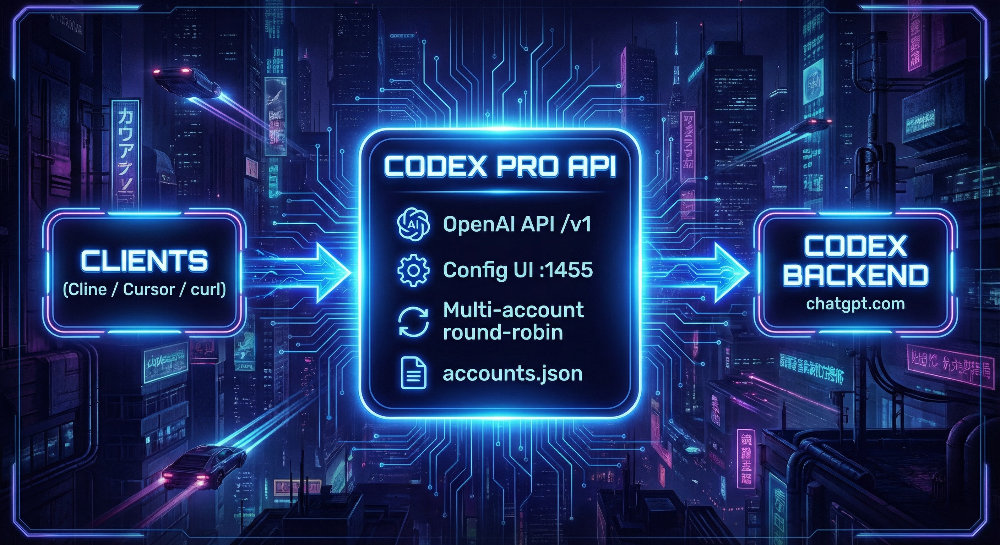
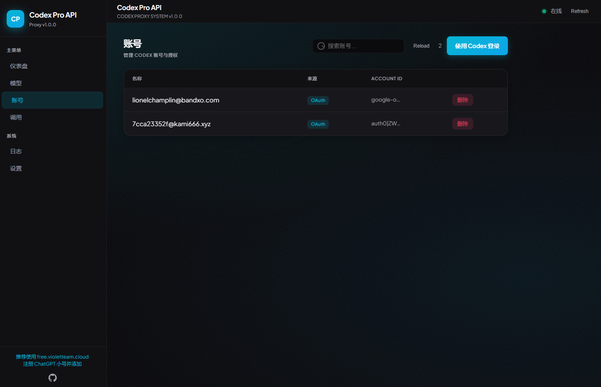
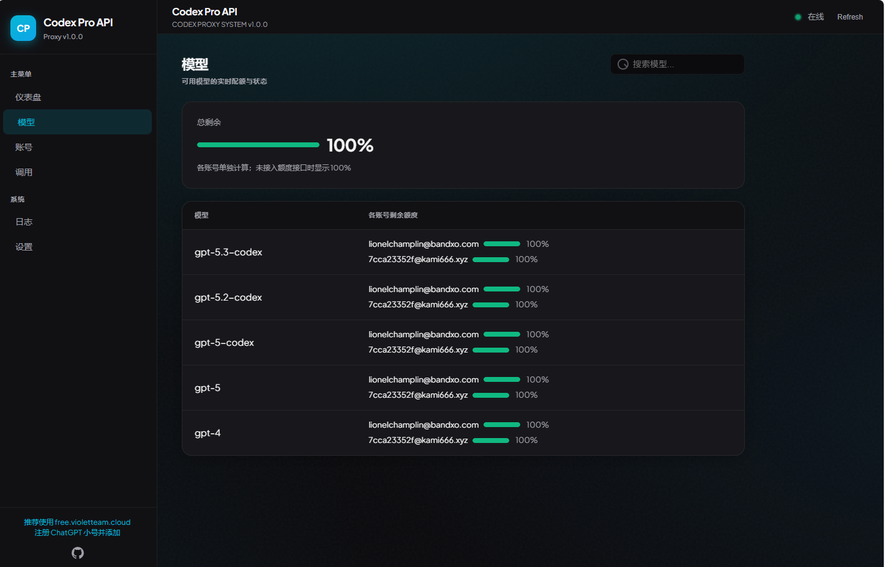

# Codex Pro API

This repository was originally cloned from [violettoolssite/codexProapi](https://github.com/violettoolssite/codexProapi.git).

Exposes **Codex** (gpt-5.5, gpt-5.4, gpt-5.4-mini, gpt-5.3-codex, gpt-image-2, and more) as an **OpenAI-compatible API** so you can use it in Cline, Cursor, or any client that supports OpenAI-style endpoints. Supports **text chat** (`/v1/chat/completions`), **image generation** (`/v1/images/generations`), and **image edits / image-to-image** (`/v1/images/edits`).

---

## Architecture



*Clients (Cline, Cursor, etc.) call the OpenAI-compatible API; this service round-robins requests using configured Codex accounts and forwards them to the Codex backend (chatgpt.com).*

---

## Screenshots

**Accounts — add Codex accounts via Login with Codex (OAuth):**



**Models — view available models and quota:**



---

## How to get started

### Option 1: Desktop app (recommended)

If you prefer not to use the command line:

1. Open [GitHub Releases](https://github.com/violettoolssite/codexProapi/releases).
2. Pick the latest release (e.g. `v1.0.8`) and download the **Windows installer** from **Assets**: `Codex Pro API Setup x.x.x.exe` (you can choose install path and desktop/Start menu shortcuts).  
   **Note:** The desktop app is **Windows only** for now; on macOS or Linux, use the command-line option below.
3. Install and run; the config page opens **inside the app window** (no browser). Closing the app stops the local service. Accounts and data are stored in your local user data directory, separate from the install folder.

### Option 2: Command line

You need **Node.js** 18 or later. In a terminal:

Install and run from this public repository:

```bash
git clone https://github.com/himmetozcan/codex-proapi.git
cd codex-proapi
npm install
npm start
```

Then open **http://localhost:1455/** in your browser.

You can also install the CLI directly from this GitHub repository:

```bash
npm install -g github:himmetozcan/codex-proapi
codex-proapi
```

The default port is **1455**.

Original npm package install:

```bash
npm install -g codex-proapi
codex-proapi
```

Or run `npm start` from the project directory after `npm install`. With global install, account and usage data are stored in `~/.codex-proapi/`.

---

## Use in your client (Cline, Cursor, etc.)

| Setting     | Value |
|------------|--------|
| **Base URL** | `http://localhost:1455/v1` (must include `/v1`; or your host/port + `/v1`) |
| **Model**    | `gpt-5.4` or `gpt-5.5` (see all: `gpt-5.5`, `gpt-5.4`, `gpt-5.4-mini`, `gpt-5.3-codex`, `gpt-5.2-codex`, `gpt-5-codex`, `gpt-5`, `gpt-image-2`, `gpt-4`) |
| **API Key**  | Any value (not validated; auth is from your Codex accounts) |

**Steps:**

1. Add accounts at **http://localhost:1455/** on the Accounts page via **Login with Codex** (or **Add account** → **Paste JSON**).
2. In your client, set the **Base URL** (must include `/v1`) and **model** as above; API Key can be anything.
3. Send requests as usual; the proxy will use your configured accounts.

---

## "Region not supported" or access_denied when logging in

If you see **region restriction**, **access_denied**, or similar after clicking "Login with Codex", your region or network may not be supported. You can:

1. **Use a VPN** and try "Login with Codex" again.
2. **Paste auth.json instead**: On a device where Codex login works (e.g. another computer or a browser with VPN), open `~/.codex/auth.json` (Windows: `%USERPROFILE%\\.codex\\auth.json`), copy its contents, then go to Accounts → Add account → Paste JSON and submit.

The same instructions are shown on the page when this error appears.

### VPN on but still "unsupported region"?

- **Make sure the login page uses the VPN too**: After clicking "Login with Codex" you are redirected to OpenAI’s login; that page must also go through your VPN. If only some apps use the proxy and the browser does not, the login page still sees your real IP. Use system-wide or browser proxy and ensure it’s on before clicking login.
- **Try another VPN server or provider**: Some servers may still be detected as unsupported, or leak IP/DNS. Try a different node (e.g. US) or another VPN.
- **Prefer pasting auth.json**: On any environment where Codex login works (e.g. another machine with VPN, or a browser that already logged in with VPN), open `~/.codex/auth.json`, copy its contents, then in Codex Pro API go to Accounts → Add account → Paste JSON. No OAuth on this machine needed.

---

## Backend 400 "Missing required parameter: tool..."

If you use OpenCode or another client that sends **tools / function calling** and get **400** with **Missing required parameter: 'tool...'**, the backend may expect a different format. This proxy now sends `tool_choice: none` when no tools are provided. If the error persists, try disabling tools/function calling in the client or use chat-only mode.

---

## Request returns "fetch failed" / proxy_error

If `POST /v1/chat/completions` returns `{"error":{"message":"fetch failed",...}}`, the service **cannot reach the Codex backend** (chatgpt.com)—the request failed before getting a response. Check:

1. **At least one account added**: On the config page, Accounts, add one Codex account (OAuth or paste auth.json).
2. **Can this machine reach chatgpt.com**: In a browser or terminal run `curl -I https://chatgpt.com`. If it times out or is blocked, enable **VPN/proxy** on the machine running the service (same as for "Login with Codex").
3. **Desktop app**: If using the desktop app, ensure that same PC can reach chatgpt.com (or enable VPN on it).

---

## Getting 403 when using a shared / hosted link

If you open the service via a link provided by someone else (e.g. `https://example.com`) and get **403** or "Token exchange failed" at the last step of "Login with Codex", the issue is with the server’s OAuth callback configuration. Contact **whoever provides that link** to fix the domain and callback settings; you don’t need to change anything on your side.

---

## Features

- **Multi-account round-robin** — Requests use your added accounts in turn; if one fails, the next is used automatically.
- **Config page** — Dashboard, Models (quota), Accounts (OAuth or paste JSON), Logs, Settings (language, base URL). Data refreshes every 5 seconds.
- **Responsive UI** — Works on desktop and mobile; sidebar collapses to a menu on small screens.
- **Image generation and edits** — Generate images from text or edit an uploaded source image with a prompt.

Multi-turn conversation is supported; send `messages` in the usual OpenAI format and the proxy will handle the rest.

### Image generation

Image generation is supported via `POST /v1/images/generations` (OpenAI-compatible), powered by the `f/conversation` protocol with `picture_v2` system hints. Supported models: `gpt-image-2` (default), `gpt-image-1.5`, `gpt-image-1`, `gpt-image-1-mini`. Images are returned as **proxy URLs** (browser-viewable) with a 30-minute cache.

```bash
curl -X POST http://localhost:1455/v1/images/generations \
  -H "Content-Type: application/json" \
  -d '{"model":"gpt-image-2","prompt":"a cat","n":1,"size":"1024x1024"}'
```

Parameters: `model`, `prompt`, `n` (1–10), `size`, `quality` (low/medium/high/auto), `output_format` (png/jpeg/webp), `background`, `moderation`.

Response (OpenAI-compatible, returns proxy URL):
```json
{"created": 1715808000, "data": [{"url": "http://localhost:1455/p/img/abc123..."}]}
```
Open the URL directly in a browser to view the generated image.

### Image edits / image-to-image

Image editing is supported via `POST /v1/images/edits` (OpenAI-compatible multipart form request). Upload one or more source images using the `image` field and provide a text prompt describing the requested change. The service uploads the source image to the ChatGPT backend, runs the same `picture_v2` image path, and returns a local proxy URL.

```bash
curl -X POST http://localhost:1455/v1/images/edits \
  -F image=@input.png \
  -F model=gpt-image-2 \
  -F prompt="Use the source image as reference and make it cinematic, no text" \
  -F n=1 \
  -F size=1024x1024
```

Parameters: `image` (required, multipart file; repeat the field for multiple images), `model`, `prompt` (required), `n` (1–10), `size`, `quality`, `output_format`, `background`, `moderation`.

Response:
```json
{"created": 1715808000, "data": [{"url": "http://localhost:1455/p/img/abc123..."}]}
```

Masks are not supported yet. Send `image` plus `prompt` for image-to-image edits.

---

## Using [free.violetteam.cloud](https://free.violetteam.cloud/) for verification

If you use [free.violetteam.cloud](https://free.violetteam.cloud/) to receive verification emails (e.g. when registering a ChatGPT/Codex account), delivery can be a bit slow—please wait. If you still don’t receive the code after a long time, click **Resend verification code**.

---

## License

MIT. Issues and suggestions: [GitHub Issues](https://github.com/violettoolssite/codexProapi/issues).
